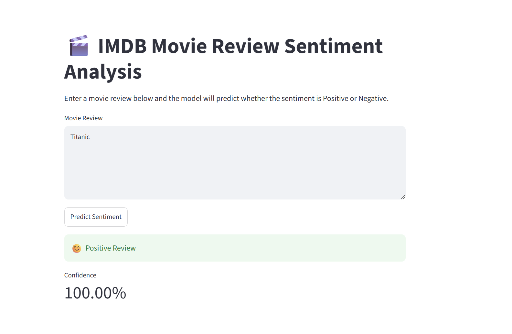

# IMDB Movie Review Sentiment Analysis using Simple RNN

##  Project Overview

This project implements a **Natural Language Processing (NLP) sentiment classification system** using a **Simple Recurrent Neural Network (Simple RNN)** built with TensorFlow/Keras.

The objective is to classify IMDB movie reviews into:

-  Positive sentiment
-  Negative sentiment

The model learns patterns from textual reviews and predicts the sentiment of unseen movie reviews.

This project demonstrates the complete deep learning workflow:
- Text preprocessing
- Sequence encoding
- Neural network modelling
- Model training
- Performance evaluation
- Model persistence for inference


---

#  Business Problem

Understanding customer opinions from large volumes of text data is valuable across industries such as:

- Healthcare patient feedback analysis
- Customer experience monitoring
- Social media analytics
- Product review intelligence

Manual review of thousands of comments is time-consuming. An automated sentiment classifier can provide scalable insights from unstructured text data.


---

#  Tech Stack

| Category | Technology |
|---|---|
| Programming Language | Python |
| Deep Learning Framework | TensorFlow / Keras |
| NLP Dataset | IMDB Movie Reviews Dataset |
| Model Architecture | Simple Recurrent Neural Network (Simple RNN) |
| Data Processing | NumPy, TensorFlow Text Utilities |
| Model Storage | HDF5 (.h5) |
| Development Environment | Jupyter Notebook / VS Code |


---

#  Project Structure

```
IMDB-Sentiment-Analysis/
│
├── notebooks/
│   └── train_model.ipynb
│   └── prediction.ipynb
│
├── models/
│   └── imdb_rnn.keras
│
├── app.py                 # Streamlit application 
│
├── requirements.txt
│
└── README.md
```


---

#  Dataset

The project uses the **IMDB Movie Review Dataset** containing:

- 50,000 movie reviews
- 25,000 training samples
- 25,000 testing samples

Each review is labelled:

| Label | Sentiment |
|---|---|
| 0 | Negative |
| 1 | Positive |


---

#  Data Preprocessing & Processing Pipeline

The text data undergoes the following preprocessing steps:

The IMDB dataset was prepared for deep learning using TensorFlow/Keras preprocessing utilities.

1. Tokenisation and Integer Encoding

The raw movie reviews are converted from text into numerical sequences.

Each word is mapped to an integer index based on its frequency in the dataset.
Example:
Original Review:
"The movie was fantastic"

Encoded Sequence:
[14, 89, 21, 678]

The vocabulary was limited to the top 10,000 most frequently occurring words:

vocab_size = 10000

Words outside this vocabulary are handled using an unknown token.

2. Sequence Padding

Movie reviews have different lengths, but neural networks require fixed-size inputs.

The distribution of IMDB review lengths was analysed before padding.

Most reviews contain fewer than 500 tokens, while longer reviews form a smaller proportion of the dataset. Therefore, a maximum sequence length of 500 was selected to balance:

- retaining meaningful review context
- reducing computational complexity
- providing consistent input dimensions for the RNN model

pad_sequences() was used to standardise all reviews to 500 tokens:

max_length = 500

Example:

Before padding:

[14, 89, 21, 678]

After padding:

[0,0,0,...,14,89,21,678]

Final input shape:

(25000, 500)

meaning:

25,000 training reviews
500 tokens per review

3. Word Embedding

The encoded sequences are passed into an embedding layer:

Embedding(
    input_dim=10000,
    output_dim=128
)

The embedding layer learns a 128-dimensional representation of words during training, allowing the model to capture semantic relationships between words.

---

#  Model Architecture

The Simple RNN model consists of:

```
Input Text
     |
     ↓
Embedding Layer
     |
     ↓
Simple RNN Layer
     |
     ↓
Dense Layer (Sigmoid Activation)
     |
     ↓
Sentiment Prediction
```


### Model Configuration

- Loss Function: Binary Cross Entropy
- Optimizer: Adam
- Activation Function: Sigmoid
- Evaluation Metric: Accuracy


---

#  Model Retraining & Version Compatibility

The original pre-trained `.h5` model file was outdated and incompatible with the current TensorFlow/Keras environment.

Instead of relying on an unavailable legacy model, I:

- Recreated the model architecture
- Retrained the Simple RNN model using the IMDB dataset
- Saved the updated trained model
- Verified inference using new predictions

This ensured the project remained reproducible and compatible with modern deep learning libraries.


---

#  Model Evaluation

The trained model was evaluated on unseen IMDB test data.

Evaluation metrics:

- Accuracy
- Loss
- Prediction confidence


Example prediction:

```
Review:
"The movie was fantastic. Great acting and storyline."

Prediction:
Positive Sentiment
Confidence: 95%
```


---

#  Running the Project

## 1. Clone Repository

```bash
git clone <repository-url>

cd IMDB-Sentiment-Analysis
```


## 2. Create Virtual Environment

```bash
python -m venv .venv
```

Activate:

Windows:

```bash
.venv\Scripts\activate
```


## 3. Install Dependencies

```bash
pip install -r requirements.txt
```


## 4. Run Notebook

Open:

```
notebooks/IMDB_Simple_RNN.ipynb
```


## 5. Run Streamlit App 

```bash
streamlit run app.py
```


---

#  Key Learnings

Through this project I gained practical experience in:

✅ Natural Language Processing workflows  
✅ Text preprocessing and sequence handling  
✅ Recurrent Neural Network architecture  
✅ TensorFlow/Keras model training  
✅ Model version compatibility issues  
✅ Saving and loading deep learning models  
✅ Building ML applications for real-world prediction  


---

#  Future Improvements

The goal of this project was to demonstrate the fundamentals of sequence modelling using recurrent neural networks. A Simple RNN provides a lightweight baseline that is easier to understand and train. For production systems requiring higher accuracy, I would evaluate LSTM, GRU, or Transformer-based models such as BERT

Potential enhancements:

- Replace Simple RNN with LSTM/GRU for better long-term dependency learning
- Implement Transformer-based models such as BERT
- Deploy using Docker and cloud platforms
- Add REST API using FastAPI
- Add monitoring for model performance drift


---

#  Author

**Neha Raj**

Data Analyst | Health Data Science | AI & Machine Learning

Interested in applying AI and data science to solve real-world healthcare and business problems.